<p align="center">
  
</p>

<p align="center">
  <strong>The first AI-native MCP server for a Spanish ERP.</strong><br/>
  <em>El primer servidor MCP nativo para un ERP espanol.</em>
</p>

<p align="center">
  <a href="https://www.npmjs.com/package/@frihet/mcp-server"></a>
  <a href="https://github.com/berthelius/frihet-mcp/blob/main/LICENSE"></a>
  <a href="https://smithery.ai/server/@frihet/mcp-server"></a>
  <a href="https://frihet.io"></a>
</p>

---

## What is this

An MCP server that connects your AI assistant to [Frihet ERP](https://frihet.io). Create invoices by talking. Query expenses in natural language. Manage your entire business from your IDE.

```
You:     "Create an invoice for TechStart SL, 40 hours of consulting at 75 EUR/hour, due March 1st"
Claude:  Done. Invoice INV-2026-089 created. Total: 3,000.00 EUR + 21% IVA = 3,630.00 EUR.
```

31 tools. 6 resources. Zero boilerplate.

---

## Install

One line. Pick your tool.

### Claude Code / Claude Desktop

```json
{
  "mcpServers": {
    "frihet": {
      "command": "npx",
      "args": ["-y", "@frihet/mcp-server"],
      "env": {
        "FRIHET_API_KEY": "fri_your_key_here"
      }
    }
  }
}
```

| Tool | Config file |
|------|------------|
| Claude Code | `~/.claude/mcp.json` |
| Claude Desktop | `~/Library/Application Support/Claude/claude_desktop_config.json` |
| Cursor | `.cursor/mcp.json` or `~/.cursor/mcp.json` |
| Windsurf | `~/.windsurf/mcp.json` |
| Cline | VS Code settings or `.cline/mcp.json` |
| Codex CLI | `~/.codex/config.toml` (MCP section) |

The JSON config is identical for all tools. Only the file path changes.

### Get your API key

1. Log into [app.frihet.io](https://app.frihet.io)
2. Go to **Settings > API**
3. Click **Create API key**
4. Copy the key (starts with `fri_`) -- it's only shown once

---

## What you can do

Talk to your ERP. These are real prompts, not marketing copy.

### Invoicing

```
"Show me all unpaid invoices"
"Create an invoice for Acme SL with 10h of consulting at 95/hour"
"Mark invoice abc123 as paid"
"How much has ClientName been invoiced this year?"
```

### Expenses

```
"Log a 59.99 EUR expense for Adobe Creative Cloud, category: software, tax-deductible"
"List all expenses from January"
"What did I spend on travel last quarter?"
```

### Clients

```
"Add a new client: TechStart SL, NIF B12345678, email admin@techstart.es"
"Show me all my clients"
"Update ClientName's address to Calle Mayor 1, Madrid 28001"
```

### Quotes

```
"Create a quote for Design Studio: logo design (2000 EUR) + brand guidelines (3500 EUR)"
"Show me all pending quotes"
```

### Webhooks

```
"Set up a webhook to notify https://my-app.com/hook when invoices are paid"
"List all my active webhooks"
```

---

## Tools reference

### Invoices / Facturas

| Tool | What it does |
|------|-------------|
| `list_invoices` | List invoices with pagination |
| `get_invoice` | Get full invoice details by ID |
| `create_invoice` | Create a new invoice with line items |
| `update_invoice` | Update any invoice field |
| `delete_invoice` | Permanently delete an invoice |
| `search_invoices` | Find invoices by client name |

### Expenses / Gastos

| Tool | What it does |
|------|-------------|
| `list_expenses` | List expenses with pagination |
| `get_expense` | Get expense details |
| `create_expense` | Record a new expense |
| `update_expense` | Modify an expense |
| `delete_expense` | Delete an expense |

### Clients / Clientes

| Tool | What it does |
|------|-------------|
| `list_clients` | List all clients |
| `get_client` | Get client details |
| `create_client` | Register a new client |
| `update_client` | Update client info |
| `delete_client` | Remove a client |

### Products / Productos

| Tool | What it does |
|------|-------------|
| `list_products` | List products and services |
| `get_product` | Get product details |
| `create_product` | Add a product or service |
| `update_product` | Update pricing or details |
| `delete_product` | Remove a product |

### Quotes / Presupuestos

| Tool | What it does |
|------|-------------|
| `list_quotes` | List all quotes |
| `get_quote` | Get quote details |
| `create_quote` | Draft a new quote |
| `update_quote` | Modify a quote |
| `delete_quote` | Delete a quote |

### Webhooks

| Tool | What it does |
|------|-------------|
| `list_webhooks` | List configured webhooks |
| `get_webhook` | Get webhook details |
| `create_webhook` | Register a new webhook endpoint |
| `update_webhook` | Modify events or URL |
| `delete_webhook` | Remove a webhook |

---

## How it works

```
Your AI assistant          frihet-mcp           Frihet API
      |                        |                    |
      |-- "create invoice" --> |                    |
      |                        |-- POST /invoices ->|
      |                        |<-- 201 Created ----|
      |<-- "Invoice created" --|                    |
```

The MCP server translates natural language tool calls into REST API requests. It handles authentication, rate limiting (automatic retry on 429), pagination, and error mapping. You just talk.

### Environment variables

| Variable | Required | Default |
|----------|----------|---------|
| `FRIHET_API_KEY` | Yes | -- |
| `FRIHET_API_URL` | No | `https://us-central1-frihet-app.cloudfunctions.net/publicApi/api/v1` |

`FRIHET_API_URL` is useful if you self-host or want to point to a staging environment.

---

## API limits

| Limit | Value |
|-------|-------|
| Requests per minute | 100 per API key |
| Results per page | 100 max (50 default) |
| Request body | 1 MB max |
| Webhook payload | 100 KB max |
| Webhooks per account | 20 max |

Rate limiting is handled automatically with exponential backoff. You don't need to think about it.

---

## Development

```bash
git clone https://github.com/berthelius/frihet-mcp.git
cd frihet-mcp
npm install
npm run build
```

Run locally:

```bash
FRIHET_API_KEY=fri_xxx node dist/index.js
```

Test with the [MCP Inspector](https://modelcontextprotocol.io/docs/tools/inspector):

```bash
npx @modelcontextprotocol/inspector node dist/index.js
```

---

## Why Frihet MCP

| | Frihet | Holded | Billin | Quipu | Anfix |
|---|:---:|:---:|:---:|:---:|:---:|
| Official MCP server | **Yes** | No (third-party) | No | No | No |
| Claude / Cursor / Windsurf | **Yes** | No | No | No | No |
| Public REST API | **Yes** | Yes | Limited | Yes | No |
| Webhooks with HMAC verification | **Yes** | No | No | No | No |
| AI assistant built-in | **Yes** | No | No | No | No |
| Open source tooling | **Yes** | No | No | No | No |

No other Spanish ERP has an official MCP server. Frihet is first.

---

## Links

- [Frihet ERP](https://frihet.io) -- The product
- [API documentation](https://docs.frihet.io/desarrolladores/api-rest) -- REST API reference
- [Webhook documentation](https://docs.frihet.io/desarrolladores/webhooks) -- Events, signatures, retries
- [MCP specification](https://modelcontextprotocol.io) -- The protocol

---

## License

MIT. See [LICENSE](./LICENSE).

Built by [BRTHLS](https://brthls.com).
